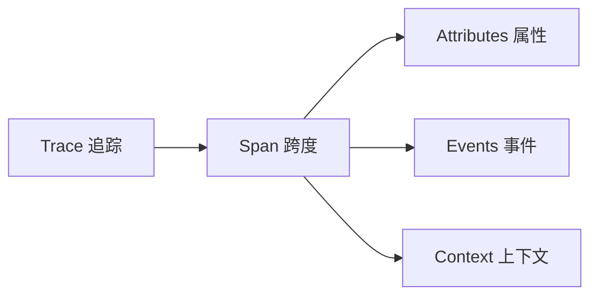

# 🔍 Agent 系统 Tracing 完整教程

## 📋 目录
1. [Tracing 基础概念](#基础概念)
2. [系统架构](#系统架构)  
3. [实际操作指南](#实际操作指南)
4. [高级 Tracing 技巧](#高级技巧)
5. [故障排查](#故障排查)
6. [最佳实践](#最佳实践)

---

## 🎯 基础概念

### Tracing 是什么？
**Tracing（追踪）** 是一种观察分布式系统中请求处理过程的技术，它可以：
- 📊 **监控性能**：追踪每个操作的耗时和资源使用
- 🐛 **调试错误**：快速定位问题发生的位置和原因
- 📈 **优化系统**：识别瓶颈和优化机会
- 🔍 **理解流程**：可视化复杂的 Agent 协作过程

### 核心组件


- **Trace**: 一次完整的请求处理过程
- **Span**: Trace 中的一个操作单元
- **Attributes**: Span 的元数据信息
- **Events**: Span 中发生的特定事件

---

## 🏗️ 系统架构

### 我们的 Tracing 技术栈
```
🤖 Agent 层
   ↓ @traced_agent_operation 装饰器
📡 OpenTelemetry SDK
   ↓ Instrumentation
🔧 自动/手动追踪
   ↓ OTLP Exporter
🌐 Phoenix UI (localhost:6006)
```

### 追踪数据流
1. **Agent 操作** → 装饰器捕获
2. **LLM 调用** → 自动 instrumentation
3. **安全检查** → 手动追踪
4. **数据汇总** → OpenTelemetry SDK
5. **可视化** → Phoenix UI

---

## 🚀 实际操作指南

### 步骤 1：启动 Tracing 系统
```bash
# 1. 启动 Phoenix UI
python3 start_phoenix.py

# 2. 验证系统状态
python3 check_phoenix.py

# 3. 运行演示工作流
python3 complete_tracing_guide.py
```

### 步骤 2：查看基础 Traces
访问 [http://localhost:6006](http://localhost:6006)，您会看到：

#### 主要界面元素：
- **Total Traces**: 总追踪数量
- **Total Cost**: 总成本（基于Token使用）
- **Latency P50/P99**: 响应时间分布
- **Spans 列表**: 所有操作的详细记录

#### 关键 Span 类型：
| Span 类型 | 说明 | 重要性 |
|----------|------|--------|
| `openai.chat` | OpenAI API 调用 | ⭐⭐⭐ |
| `agent_generate_reply` | Agent 生成回复 | ⭐⭐⭐ |
| `content_moderation` | 内容安全检查 | ⭐⭐ |
| `output_validation` | 输出验证 | ⭐⭐ |
| `agent_conversation` | 对话记录 | ⭐ |

### 步骤 3：深入分析 Span
点击任意 Span 查看详细信息：

#### Span 详细信息包含：
```json
{
  "span_id": "abc123...",
  "trace_id": "def456...",
  "operation_name": "agent_generate_reply",
  "start_time": "2025-01-30T14:56:00Z",
  "duration": "8.32s",
  "attributes": {
    "agent.operation": "agent_generate_reply",
    "agent.status": "success",
    "input.messages": "[{\"role\": \"user\", \"content\": \"...\"}]",
    "output.result": "生成的回复内容..."
  },
  "events": [
    {
      "name": "thinking_start",
      "timestamp": "2025-01-30T14:56:01Z"
    }
  ]
}
```

### 步骤 4：过滤和搜索
使用 Phoenix UI 的过滤功能：

```bash
# 过滤示例
span_kind == 'LLM'           # 只看 LLM 调用
latency > 5s                 # 找出慢操作
agent.status == 'error'      # 查看错误
input contains '股票'        # 搜索特定内容
```

---

## 🔬 高级 Tracing 技巧

### 1. 自定义 Agent 追踪
```python
from observability import traced_agent_operation

class MyAgent:
    @traced_agent_operation("custom_operation")
    def my_function(self, input_data):
        # 你的代码逻辑
        return result
```

### 2. 手动添加 Span 属性
```python
def enhanced_function(self, query):
    with self.tracer.start_as_current_span("custom_span") as span:
        span.set_attribute("query.type", "market_analysis")
        span.set_attribute("query.complexity", 0.8)
        
        # 执行业务逻辑
        result = process_query(query)
        
        span.set_attribute("result.confidence", result.confidence)
        return result
```

### 3. 记录自定义事件
```python
from observability import log_conversation

# 记录重要的业务事件
log_conversation(
    agent_name="portfolio_manager",
    message="执行了买入操作：AAPL 100股",
    role="system",
    metadata={
        "action": "buy_stock",
        "symbol": "AAPL", 
        "quantity": 100,
        "price": 150.25
    }
)
```

### 4. 批量操作追踪
```python
@traced_agent_operation("batch_analysis")
async def analyze_multiple_stocks(self, symbols):
    results = {}
    
    for symbol in symbols:
        with self.tracer.start_as_current_span(f"analyze_{symbol}") as span:
            span.set_attribute("stock.symbol", symbol)
            result = await self.analyze_single_stock(symbol)
            span.set_attribute("analysis.score", result.score)
            results[symbol] = result
    
    return results
```

---

## 🛠️ 故障排查

### 常见问题 & 解决方案

#### 1. **Traces 显示为空**
```bash
# 检查 Phoenix 是否正确启动
python3 check_phoenix.py

# 验证 ObservabilityManager 初始化
python3 -c "
from observability import ObservabilityManager
mgr = ObservabilityManager()
mgr.initialize()
print('✅ 初始化成功')
"
```

#### 2. **Input/Output 显示 "--"**
参考 `FIXING_INPUT_OUTPUT_DISPLAY.md` 文档的解决方案。

#### 3. **延迟数据不准确**
```python
# 确保正确的时间测量
import time

@traced_agent_operation("timed_operation")
def my_operation(self):
    start_time = time.time()
    
    # 业务逻辑
    result = do_work()
    
    duration = time.time() - start_time
    # Phoenix 会自动记录 Span 的持续时间
    return result
```

#### 4. **Span 缺失或不完整**
```python
# 确保异常情况也被正确追踪
@traced_agent_operation("robust_operation")  
def robust_function(self):
    try:
        return risky_operation()
    except Exception as e:
        # 异常会自动记录到 Span
        logger.error(f"操作失败: {e}")
        raise
```

---

## 📖 最佳实践

### 1. 合理的 Span 粒度
```python
# ✅ 好的做法：追踪有意义的业务操作
@traced_agent_operation("market_analysis")
def analyze_market(self, query):
    return self.perform_analysis(query)

# ❌ 避免：过于细粒度的追踪
@traced_agent_operation("add_numbers")  # 太细了
def add(self, a, b):
    return a + b
```

### 2. 有意义的属性命名
```python
# ✅ 清晰的属性命名
span.set_attribute("user.query", query)
span.set_attribute("analysis.confidence_score", 0.95)
span.set_attribute("model.name", "gpt-4o")

# ❌ 避免：无意义的属性
span.set_attribute("data", some_data)  # 太模糊
```

### 3. 控制追踪开销
```python
# 对于频繁调用的函数，考虑采样
@traced_agent_operation("high_frequency_operation")
def frequent_function(self):
    # 只追踪重要或异常情况
    if self.should_trace():
        with self.tracer.start_as_current_span("detailed_analysis"):
            return detailed_analysis()
    else:
        return simple_analysis()
```

### 4. 安全和隐私
```python
# 避免记录敏感信息
@traced_agent_operation("user_authentication")
def authenticate_user(self, username, password):
    span = trace.get_current_span()
    span.set_attribute("user.name", username)  # ✅ 可以记录
    # span.set_attribute("user.password", password)  # ❌ 不要记录密码
    
    return authenticate(username, password)
```

---

## 📊 监控仪表板

### 创建自定义监控视图
```python
# 示例：创建实时监控脚本
def create_monitoring_dashboard():
    metrics = {
        "active_agents": count_active_agents(),
        "avg_response_time": calculate_avg_latency(),
        "error_rate": calculate_error_rate(),
        "token_usage": get_token_consumption()
    }
    
    # 发送到监控系统或显示在仪表板
    return metrics
```

### Phoenix UI 高级功能
- **时间范围筛选**: 查看特定时间段的数据
- **Span 对比**: 比较不同操作的性能
- **错误追踪**: 快速定位和分析错误
- **成本分析**: 基于Token使用量的成本追踪

---

## 🎯 总结

通过有效的 Tracing，您可以：
- 🔍 **深入了解** Agent 系统的运行情况
- ⚡ **快速定位** 性能瓶颈和错误
- 📈 **持续优化** 系统性能和用户体验
- 💰 **控制成本** 通过监控API使用量

记住：**好的 Tracing 是系统可观测性的基础，也是构建可靠 AI 系统的关键！**

## 🔗 相关资源
- [complete_tracing_guide.py](./complete_tracing_guide.py) - 完整演示脚本
- [Phoenix UI](http://localhost:6006) - 可视化界面
- [check_phoenix.py](./check_phoenix.py) - 系统诊断工具 